# Практична робота: Основи роботи з Apache Kafka у розподілених базах даних

**Студент:** Ремига Богдан Сергійович  
**Дисципліна:** Розподілені бази даних  
**Група:** ТР-61мп

## Тема

Основи роботи з Apache Kafka у розподілених базах даних.

## Мета

- Ознайомитися з архітектурою Apache Kafka та її роллю в обробці потокових даних.
- Навчитися створювати топіки, продюсерів і консюмерів.
- Відпрацювати передачу повідомлень у розподіленому середовищі.

## Лістинг

Код проєкту: [`kafka-energy-remyha`](kafka-energy-remyha)

- [`scripts/simple_producer.py`](kafka-energy-remyha/scripts/simple_producer.py)
- [`scripts/simple_consumer.py`](kafka-energy-remyha/scripts/simple_consumer.py)
- [`config/server.properties`](kafka-energy-remyha/config/server.properties)
- [`config/zookeeper.properties`](kafka-energy-remyha/config/zookeeper.properties)
- [`start-zookeeper.cmd`](kafka-energy-remyha/start-zookeeper.cmd), [`start-kafka.cmd`](kafka-energy-remyha/start-kafka.cmd), [`env.cmd`](kafka-energy-remyha/env.cmd)

Репозиторій: https://github.com/Mast0/DistributedDB

## Середовище

| Компонент | Версія |
|---|---|
| ОС | Windows 11 |
| Kafka | 3.7.1 (Scala 2.13), з ZooKeeper |
| Java для Kafka | Temurin JDK 21 (portable, у `jdk21/`) |
| Python | 3.13 |
| kafka-python | 3.0.11 |

На машині встановлена Java 25, яка не підтримується Kafka 3.7.1 (потрібно ≤ 21), тому Kafka запускається з портативної JDK 21, без змін у системі.

## Хід роботи

### Крок 1. Підготовка середовища

Створено проєкт `kafka-energy-remyha` зі структурою `config`, `data`, `scripts`, а також portable JDK 21 і Kafka 3.7.1. Перевірка Java та структури проєкту:

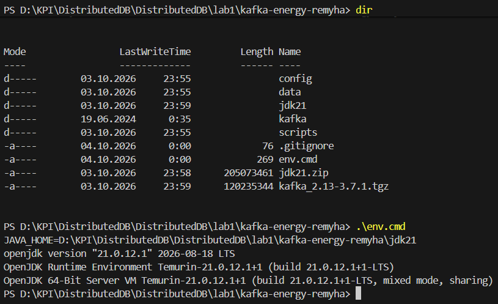

### Крок 2. Налаштування Kafka

У `config/server.properties` та `config/zookeeper.properties` задано параметри (3 партиції за замовчуванням, реплікація 1, зберігання 7 днів, `log.dirs=../kafka-logs`, `dataDir=../data/zookeeper`).

### Крок 3. Запуск Kafka

ZooKeeper (порт 2181):

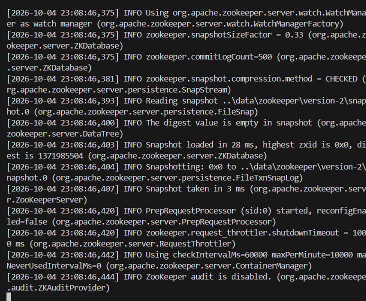

Брокер Kafka (порт 9092):

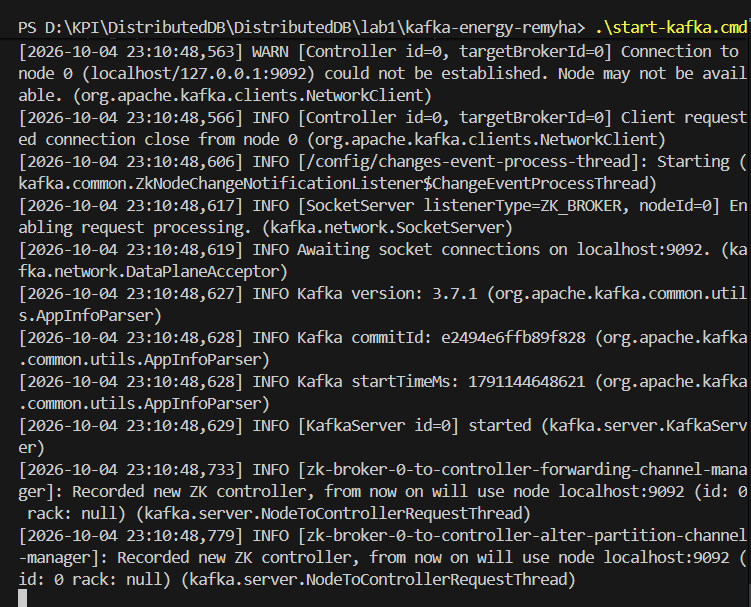

Перевірка портів і версії API:

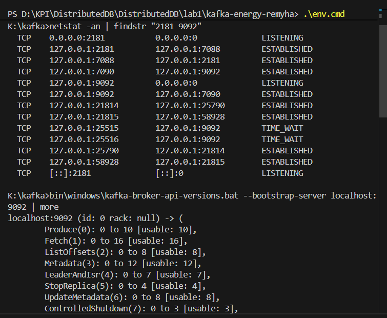

### Крок 4. Робота з топіками

Створення топіків і їх список:

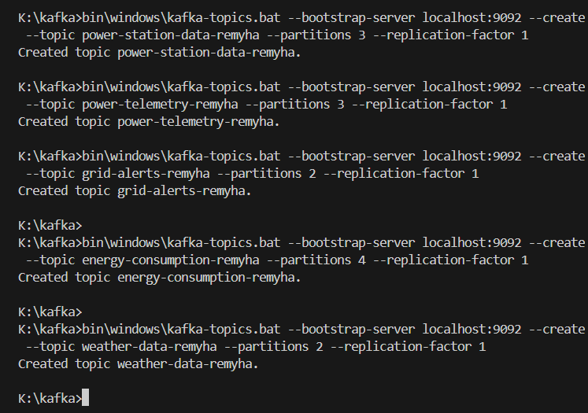

Опис топіка `power-station-data-remyha`:

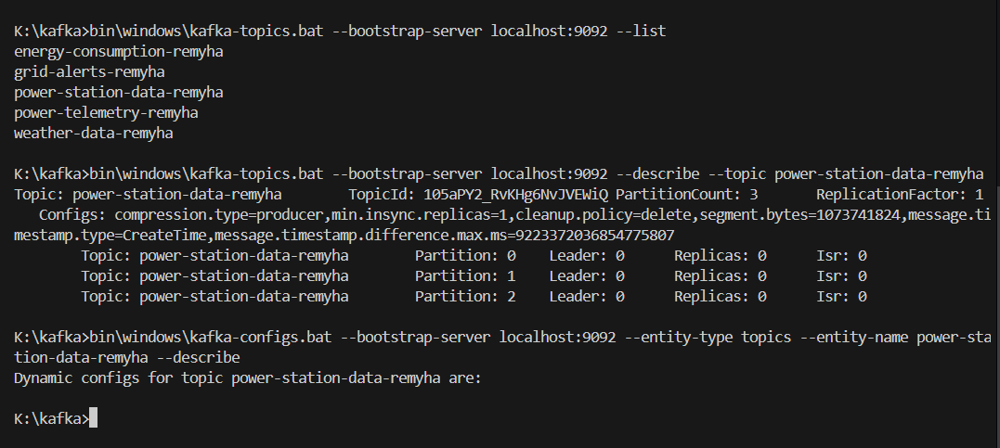

Тест продуктивності продюсера:

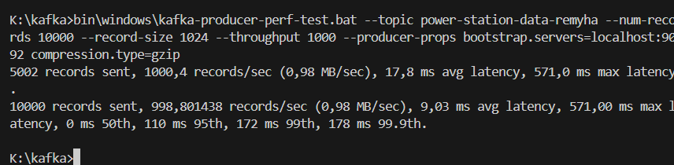

### Крок 5. Producer

Консольний продюсер:

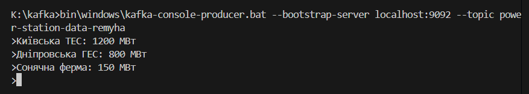

Консольний консюмер із тими ж повідомленнями:

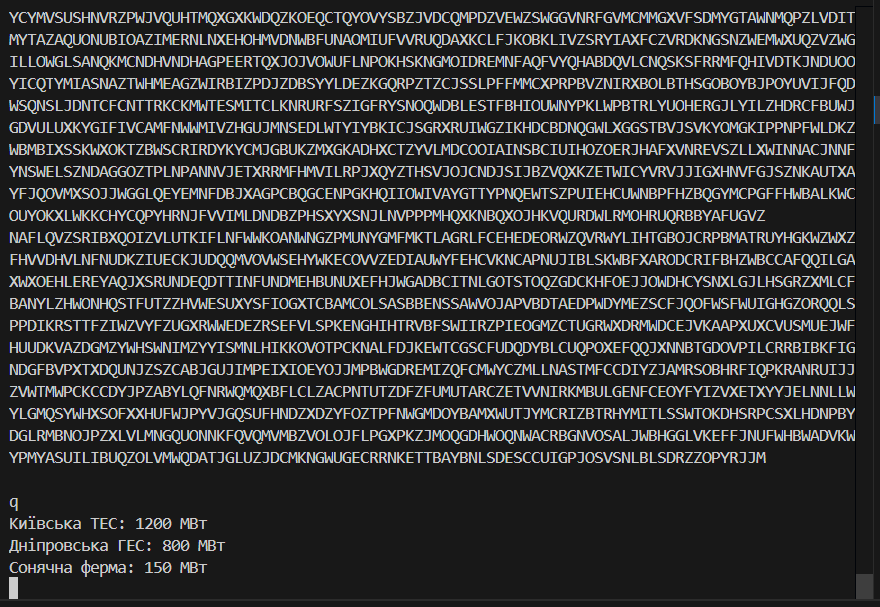

Python Producer:

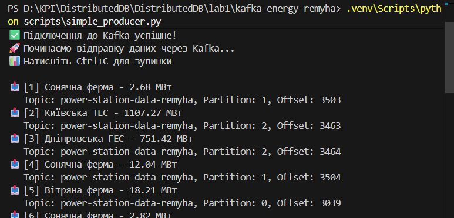

### Крок 6. Consumer

Python Consumer:

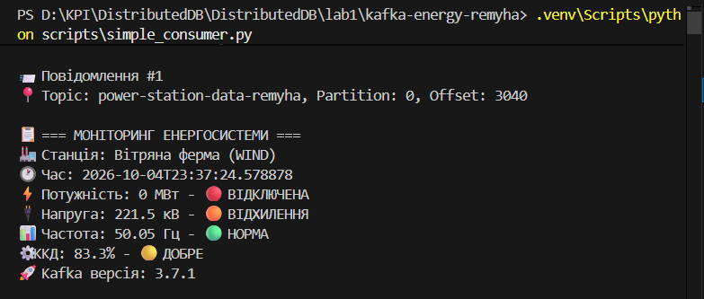

### Крок 7. Моніторинг

Список топіків, груп консюмерів і детальна інформація про групу `energy-monitor-remyha-*`:

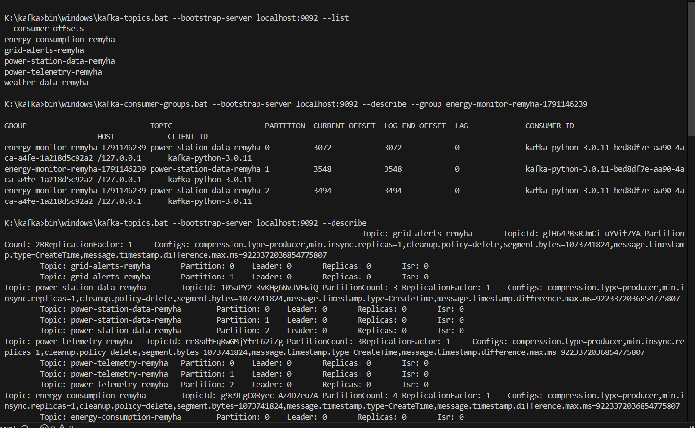

Тест продуктивності консюмера:

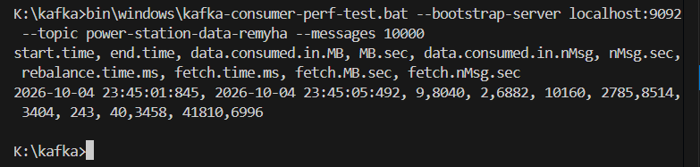

Конфігурації брокера та топіка:

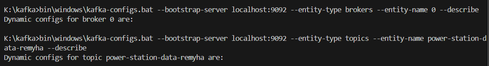

Директорії логів (`kafka-log-dirs`):

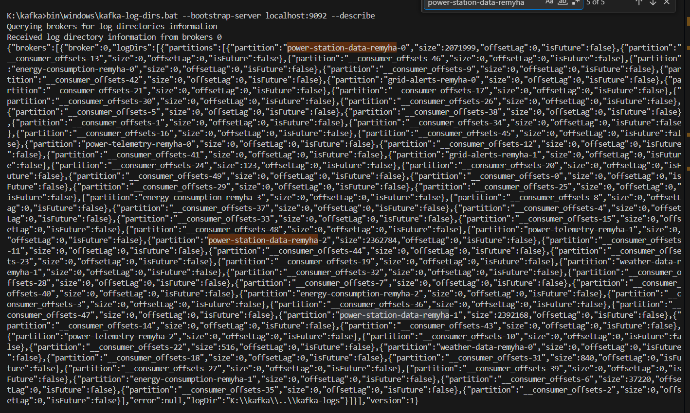

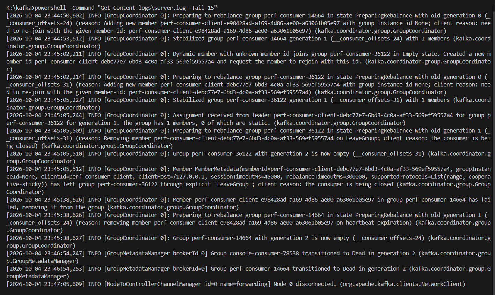

### Крок 8. Зупинка системи

Коректна зупинка Python Producer та Consumer:

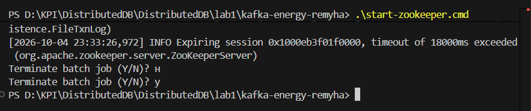

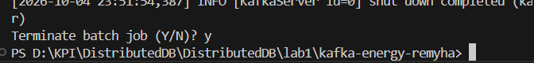

Перевірка: порти 2181 і 9092 вільні, процесів `java` немає:

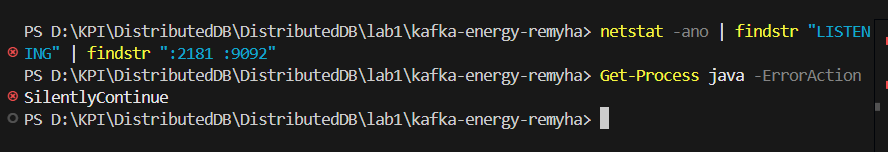

## Контрольні питання

**1. Яка різниця між partition та topic?**  
Topic — логічна категорія повідомлень. Partition — фізична частина топіка: впорядкований лог, який можна зберігати на різних брокерах і обробляти паралельно. Порядок повідомлень гарантується тільки в межах однієї партиції.

**2. Як працює replication у кластері Kafka?**  
Кожна партиція має одного лідера та кілька фоловерів на інших брокерах. Продюсери й консюмери працюють з лідером, а фоловери копіюють його лог. Репліки, що встигають за лідером, входять до ISR. Якщо лідер відмовляє, новим лідером стає репліка з ISR. У цій роботі один брокер, тому replication factor = 1.

**3. Чому Kafka добре підходить для IoT-систем?**  
Вона витримує великий потік повідомлень від багатьох датчиків, масштабується партиціями, зберігає дані певний час і відв'язує джерела від споживачів: кожен датчик пише в Kafka один раз, а читати можуть багато систем незалежно.

**4. Як налаштувати offset management для consumer groups?**  
Група консюмерів зберігає позицію у службовому топіку `__consumer_offsets`. Параметри: `group.id`, `enable.auto.commit` та `auto.commit.interval.ms` для автоматичного коміту, `auto.offset.reset` (`earliest`/`latest`) для вибору стартової позиції. Для точнішого контролю використовують ручний коміт після обробки. Стан групи видно через `kafka-consumer-groups --describe` (CURRENT-OFFSET, LOG-END-OFFSET, LAG), а скидати офсети можна опцією `--reset-offsets`.

**5. Які переваги має Schema Registry для енергетичних систем?**  
Він зберігає схеми повідомлень і перевіряє, що продюсери й консюмери використовують сумісні формати. Це дозволяє змінювати структуру телеметрії без поломки консюмерів, зменшує розмір повідомлень і гарантує якість даних.

## Висновок

Налаштовано Kafka 3.7.1 із ZooKeeper на Windows, створено топіки з прізвищем студента, протестовано консольні та Python-продюсер і консюмер для телеметрії електростанцій, переглянуто стан топіків, груп консюмерів, продуктивність і логи, після чого систему коректно зупинено.
